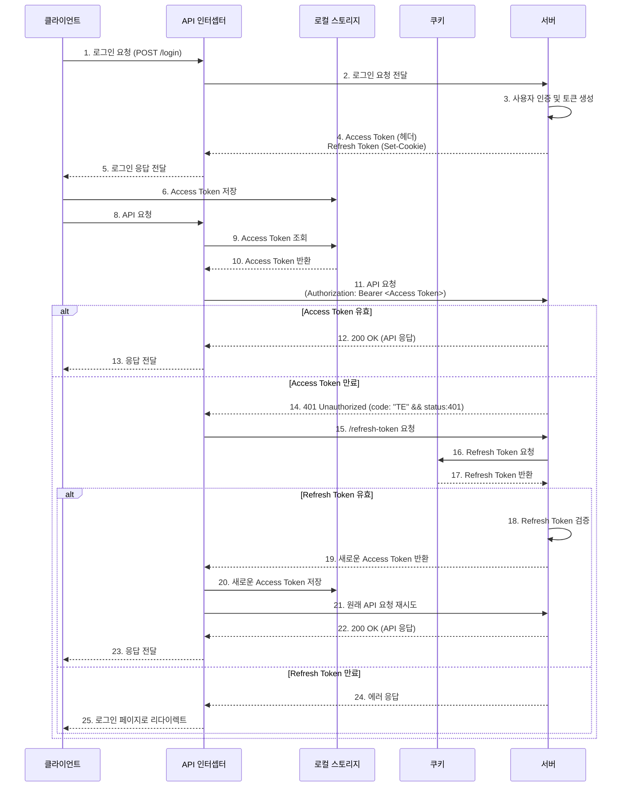

 
# WithDog - 반려견과 함께, 어디든지! 🐾
**반려견과 함께하는 특별한 순간을 위한 서비스**

## 📖 프로젝트 상세 설명 및 문제 해결: [WithDog Notion link](https://hyunsense.notion.site/WithDog-16f05c7d6d4280609643d17696da6b89?pvs=4)
## 👉 현재 운영 중인 배포 링크: [🚀 WithDog 바로가기](https://www.withdog.store)

## 📌 프로젝트 개요
### ❓ 왜 WithDog을 만들었나요?
반려인 1500만 시대, 반려견과 함께하는 여행 수요가 증가했지만, 반려견 동반 가능 여부, 시설 조건 등에 대한 정보가 분산되어 있어 검색에 시간이 많이 소요되었습니다.  
이러한 문제를 해결하기 위해, **실제 방문한 반려인들의 리뷰와 사진을 기반으로 신뢰할 수 있는 정보를 제공**하며, **효율적인 필터 검색으로 맞춤형 장소 추천**을 목표로 개발되었습니다.

<!-- ### ✨ 핵심 가치
✅ **Discover**: 지역/카테고리 기반 맞춤형 장소 추천  
✅ **Connect**: 반려인 커뮤니티 기반 리뷰 시스템(추가 개발 예정)  
✅ **Trust**: 관리자 검증을 통한 신뢰할 수 있는 정보 -->

## 🖥️ 시연 영상
 장소 목록 |  장소 상세정보 |  장소 북마크
---|---|---|

 장소 등록 및 수정 |  장소 검색 |  로그인 & 회원가입
---|---|---|

## 📜 REST API 명세서: [API Documentation](https://hyunsense.notion.site/withDodg-RESTapi-17b05c7d6d42802cae8bccaff7fca8c6?pvs=4)

기능|메서드|URL `/api/v1`
----|---|----|
로그인 | POST | `/login`
로그아웃 | GET | `/logout`
회원가입 | POST | `/members`
장소 전체 조회 | GET | `/plaecs`
장소 상세 조회 | GET | `/places/${id}`
장소 등록 | POST | `/places`
장소 수정 | PUT | `/places/${id}`
장소 삭제 | DELETE | `/places?ids=${ids}`
북마크 상태 조회 | GET | `/places/${id}/boormarks/status`
북마크 목록 조회 | GET | `/places/bookmarks`
북마크 단일 삭제 | DELETE | `/places/${id}/bookmarks`
북마크 다중 삭제 | DELETE | `/places/bookmarks`
북마크 등록 | POST | `/places/${id}/bookmarks`
북마크 삭제 | DELETE | `/places/${id}/bookmarks`
상위 TOP3 조회 | GET | `/places/top3`
최근 등록 장소 조회 | GET | `/places/recent?=`
추천 장소 조회 | GET | `/places/random?=`
장소 검색 | GET | `/places/search?=`
장소 검색결과 개수 | GET | `/places/search/result/count?=`
장소 전체 개수 | GET | `/places/count`

## 🛠️ 기술 스택
### FrontEnd
기술 스택 | 버전 | 활용 내용 |
---|---|---|
**React** | 18.3 | 함수형 컴포넌트 및 Custom Hooks 기반 SPA 구현
**React Router** |  6 | 동적 라우팅 적용
**ContextAPI** | - | 전역 사용자 인증 상태 관리 (JWT 기반)
**Styled-Components** | - | CSS-in-JS 방식으로 동적 테마 적용 및 스타일 모듈화

### Backend
기술 스택 | 버전 | 활용 내용 |
---|---|---|
**Spring Boot** | 3.3.4 | RESTful API 설계, 비즈니스 로직 구현 및 JPA 연동 
**Spring Security** |  6.3 | JWT 및 소셜 로그인(OAuth2) 기반 인증 구현
**Jsoup** | - | 블로그 Open Graph 메타데이터 스크래핑 (네이버, 다음)
**MySQL** |  8.0 | 데이터 저장, JPA Query 최적화

### Infrastructure & DevOps
기술 스택 | 활용 내용 |
---|---|
**AWS EC2, RDS** | 백엔드 서버 및 데이터베이스 호스팅
**AWS S3** | - **이미지 파일 저장소**: 반려견 관련 이미지 파일 저장 및 안정적인 제공 - **Spring Boot 배포 저장소**: 백엔드 애플리케이션 배포 파일 저장 및 관리 - **정적 웹호스팅**: 프론트엔드 정적 파일(HTML, CSS, JS) 호스팅으로 서버리스 환경 구현  → 이를 통해 무중단 배포 및 빠른 업데이트가 가능
**AWS SSM Parameter Store** | 환경변수(DB_URL, API 키 등)를 암호화하여 중앙 관리  `start.sh` 에서 `aws ssm get-parameter` 을 이용하여 동적으로  주입
**AWS CloudFront** | - 엣지 서버를 통한 콘텐츠 캐싱 및 배포  - **빠른 배포 및 낮은 지연 시간**: 정적 콘텐츠의 빠른 로딩과 응답속도 개선  (🚀 이미지 로딩 속도 약 30% 개선)  - **캐싱 정책 적용**: 원본(S3) 요청 횟수 대폭 감소 및 안정적 서비스 제공
**Nginx** | 리버스 프록시 및 SSL (Let's Encrypt) 설정으로 HTTPS 환경 제공  `https://api.withdog.store` -> `http://localhost:8080` 요청을 중계
**GitHub Actions  + CodeDeploy** | CI/CD 자동화 배포 (⚡ 5분 -> 1분으로 개선)

## Architecture

## 로그인 인증 시퀀스
### Frontend Server

### Backend Server (Spring Security)
**JWT 일반 로그인 flow** | **Oauth2 로그인 flow**
---|---|
  | 

## ERD
### 🔗 [ERD 상세보기](https://www.erdcloud.com/d/J8ax78zWsn5kLZ5Fj)

## 📈 핵심 기능
### 1️⃣ 장소 탐색
- 장소 필터 검색:
    - 사용자가 원하는 조건(예: 서울, 카페, 대형견 허용, 주차 가능 등) 을 자유롭게 조합해 검색하여 맞춤형 장소 추천
    - 약 30가지 이상의 필터 조합(지역, 장소 유형, 반려견 크기, 제공 서비스 등)을 지원하며, 키워드 검색과 함께 사용 가능
    - 무한스크롤을 적용해 자동 페이지 처리로 사용자 경험을 개선
- 실시간 인기 장소 추천:
    - 주간 조회수 기반 TOP3 장소 자동 추천
- 최근 등록된 장소
    - 관리자가 등록한 최신 장소들을 추천
- 랜덤 추천 장소
    - 사용자를 위한 매번 다른 장소 추천

### 2️⃣ 장소 상세 정보 확인
- 다양한 이미지와 블로그 후기:
    - 사용자들이 업로드한 실제 방문 사진과 블로그 후기 확인
    - 블로그 URL 입력 시 제목/썸네일 자동 생성
- 상세 정보 제공:
    - 주소, 가격, 위치 등 필수 정보 한눈에 확인

### 3️⃣ 관리자 장소 등록 및 관리
- 다중 이미지 업로드:
    - 최대 5장의 사진을 순서대로 업로드
    - 업로드 후 순서 변경 가능
- 블로그 후기 공유:
    - 방문한 장소의 블로그 URL 공유
    - 메타데이터 자동 추출로 간편한 입력

### 4️⃣ 실시간 통계
- 조회수 + 북마크수 기반 인기 장소 분석:
    - 등록한 장소의 주간 조회수 및 북마크수 집계
    - 사용자들이 가장 많이 찾은 장소 TOP3 제공

### 5️⃣ 편리한 로그인 및 보안
- 소셜 로그인 지원:
    - 네이버/카카오로 간편 로그인
- 안전한 계정 관리:
    - JWT 기반 자동 토큰 갱신
    - Redis를 활용한 보안 강화 (추후 지원 예정)

## 🎯 성과
- **도메인 구매 및 서비스 운영**:
  - `www.withdog.store`와 `api.withdog.store`를 분리해 실 서비스 환경 구현
  - Nginx를 활용한 서브도메인 설정으로 안정적인 요청 처리와 사용자 접근성 향상.
- **UI/UX 개선**
    - 폼 검증 강화: 회원가입시 실시간 유효성 검사 (이메일형식, 패스워드 복잡도 표시)
    - 오류 메시지 구체화: "비밀번호는 8~12자 영문 대소문자와 숫자, 특수문자는 선택 입력해주세요." 와같은 명확한 가이드 제공 
- **CloudFront 캐시 정책**:
  - 이미지 로딩 시간 약 30% 개선
  - 원본(S3) 요청 횟수 감소로 AWS 비용 절감
- **CI/CD 자동화 경험**
    - 문제 상황: 기존에는 로컬에서 수동으로 Jar 파일을 빌드 후 AWS 서버에 수동으로 복사하느라 지속적으로 배포 속도가 느리고 오류 가능성이 높았음.  
    - 해결: GitHub Actions에서 Jar 빌드 후 CodeDeploy 배포 스크립트를 설정. 자동화된 배포로 **약 5분 → 1분으로 배포 시간 단축**
- **환경변수 관리**
    - AWS SSM Parameter Store로 민감한 정보를 관리하며 보안 강화.
- **CORS 이슈 해결**
    - Nginx와 Spring Security를 통해 HTTPS 환경에서 안정적인 API 호출
- **검색 필터 구현**
    - 사용자가 선택한 필터 조건(지역, 장소 유형, 반려견 크기 등)에 따라 동적으로 JPQL을 생성해 쿼리를 실행
    - Builder 패턴을 활용해 복잡한 동적 쿼리의 가독성과 유지보수성을 개선

## 🌱회고
1. **React 입문과 CSR/SPA 방식 익히기**
    - React 입문을 시작한 이유는, 기존에 ViewTemplate + jQuery 로 SSR + CSR방식만 사용해보았습니다.  CSR과 SPA인 React를 사용하여 프론트엔드와 백엔드가 명확히 분리돼서 데이터 통신이 어떻게 되는지 경험하고, CSR/SPA 방식이 뭔지 몸으로 느껴보고 싶었습니다. 물론 실무와는 차이가 크겠지만, 신입으로서 기본 개념을 잡는 데 의미가 있었다고 생각합니다.
2. **Refresh Token 보안 문제**
    - JWT 인증과정에서 Refresh Token 재사용을 막는 보안이 필요하다고 생각하였습니다. Redis를 이용하여 토큰의 유효성과 만료시간을 관리하면 좋을것 같지만  아직 Redis에 대한 경험이 부족해 적용하지 못했습니다. 현재는 서명과 만료시간으로 유효성을 확인하고있습니다. 관계형 DB로도 구현이 가능하지만, 앞으로 Redis에 대한 학습을 하여 더 효율적이고 안전한 인증 시스템을 만들 계획입니다.
3. **성능테스트를 못해서 아쉬움**
    - 로컬의 Docker에서 k6, promethus, grafana 를 통해 성능 테스트를 해봤지만, 프로젝트의 규모가 작아 성능 변화가 크지 않았습니다. 분석 방법도 익숙치 않아 아쉬웠고, 도구 설정과 실행에 비해 얻은 인사이트가 적었습니다. 기회가 된다면 성능 테스트 방법과 분석스킬을 더 공부해 실무에서 활용해 보고 싶습니다.

